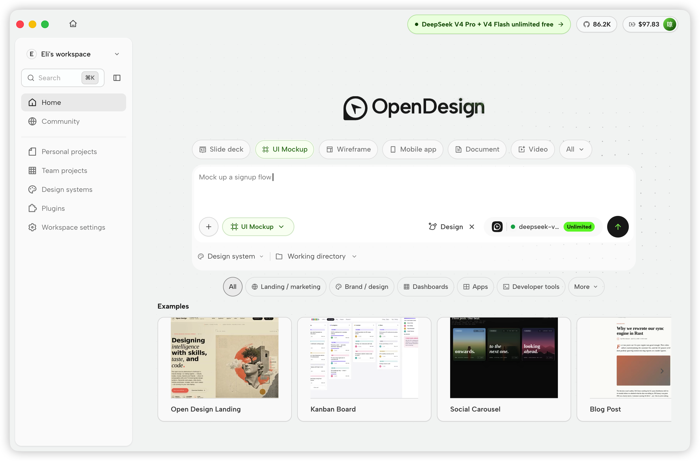
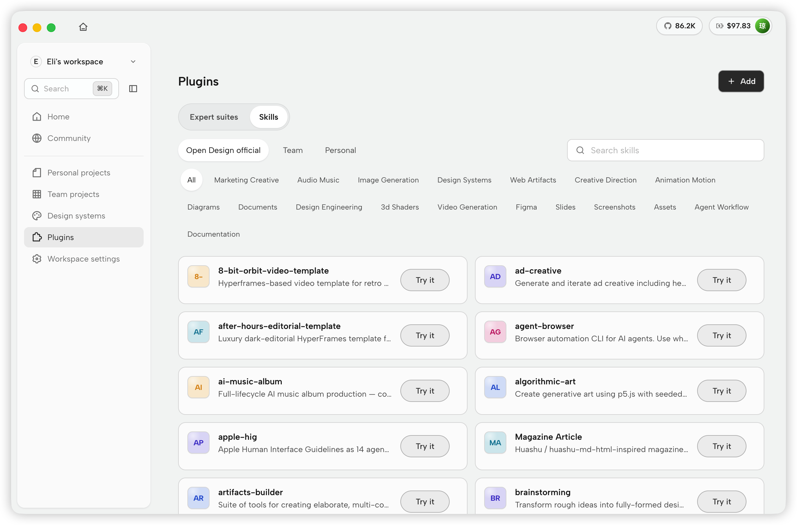
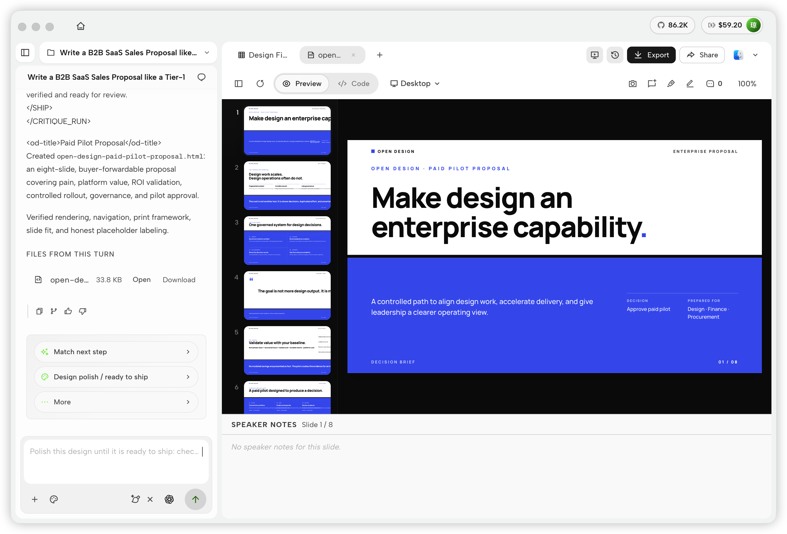
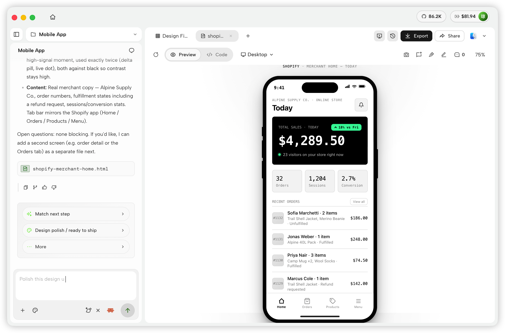
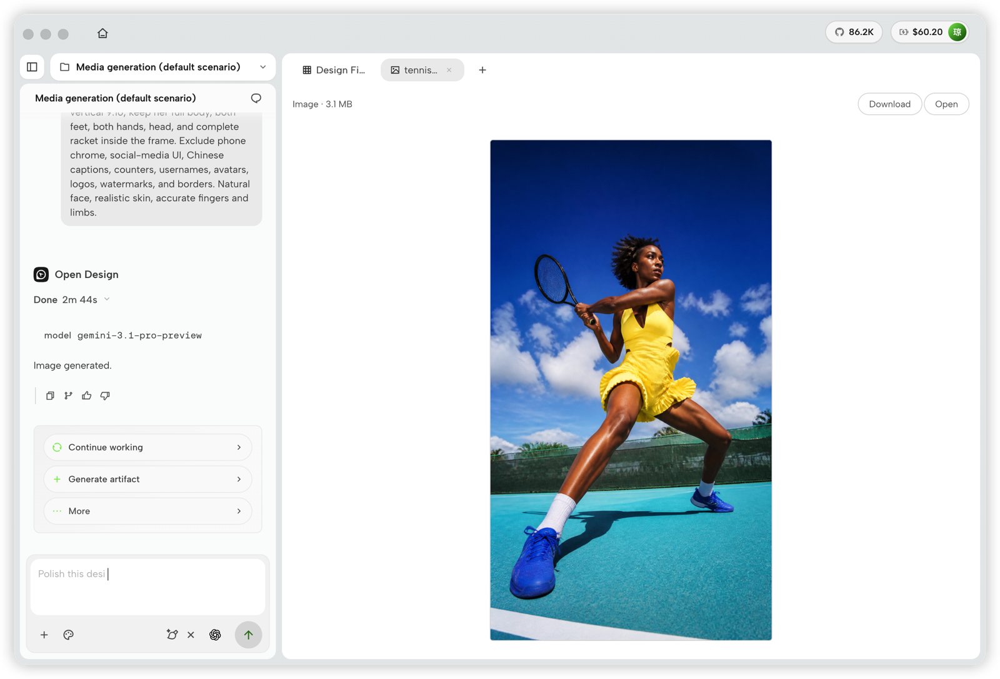
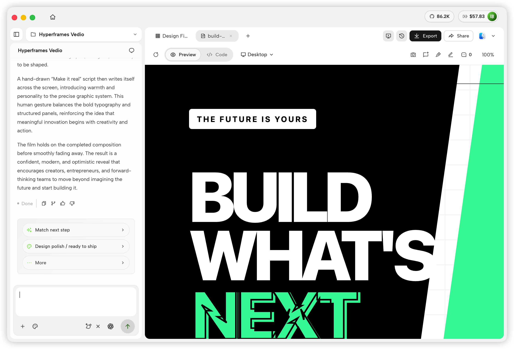
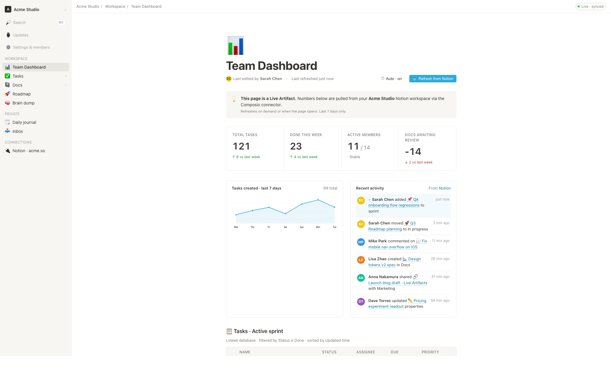
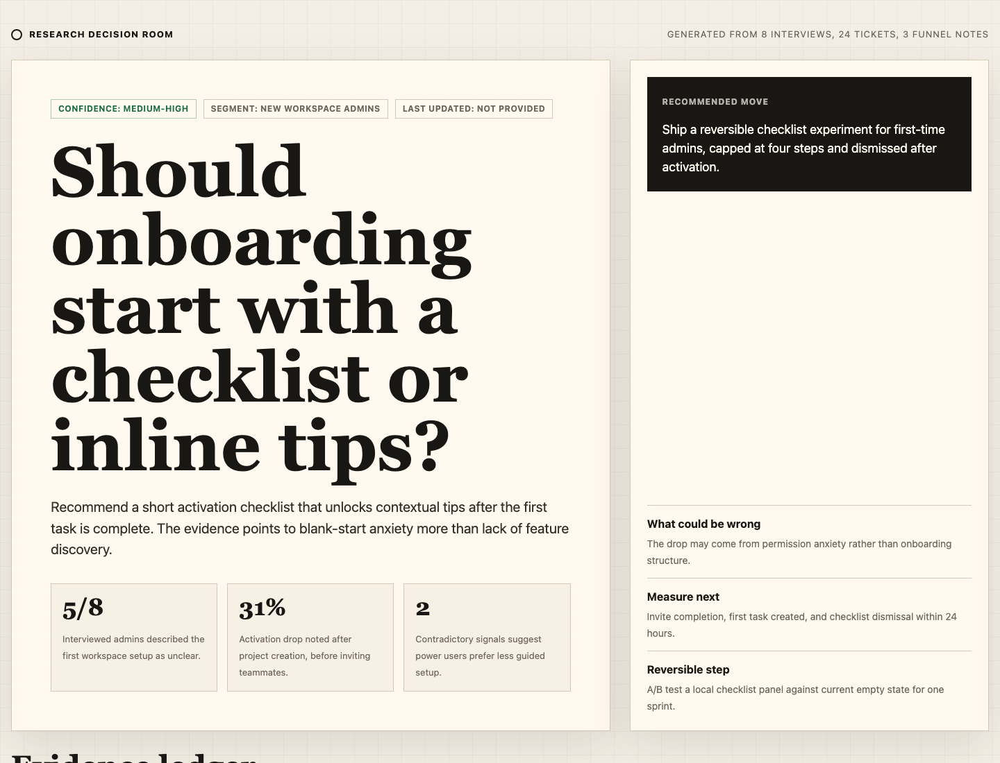
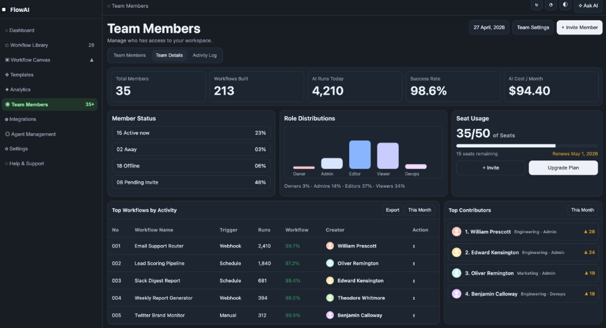
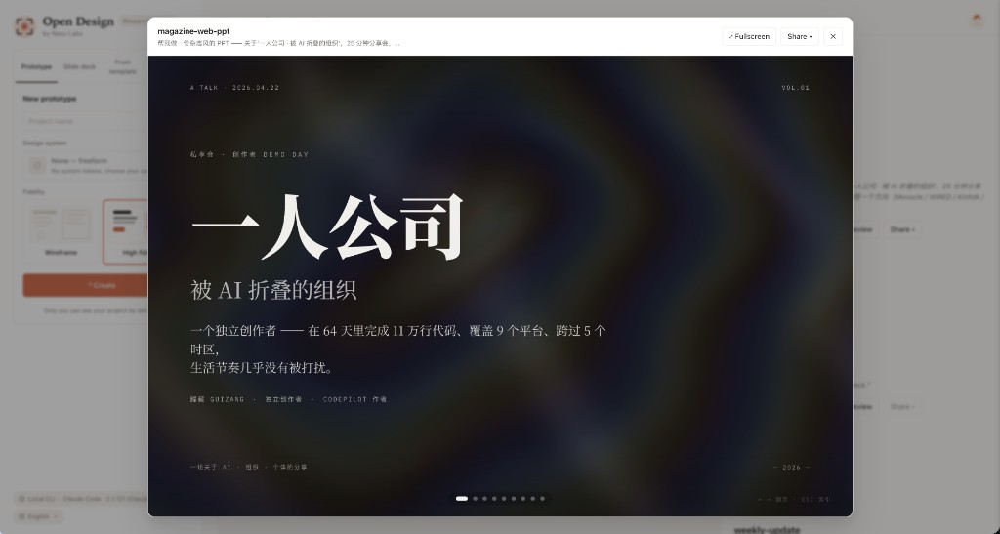

<h1 align="center">Open Design : l'alternative open source à Claude Design</h1>

> ⚡ **[Open Design Cloud — le service de modèles officiel.](https://open-design.ai/zh/pricing/)** Une seule recharge pour utiliser des modèles d'agents et d'images dans Open Design : GPT, Claude et DeepSeek pour les agents ; GPT Image 2.0, Seedream 5.0 Pro et Nano Banana 2.0 pour les images.
>
> 🚀 **[DeepSeek V4 Flash et V4 Pro sont maintenant disponibles.](https://open-design.ai/zh/pricing/)** Mettez une intelligence de premier plan au service des prototypes, présentations, systèmes de design et tâches quotidiennes des agents. Les membres Open Design peuvent utiliser les deux modèles sans limite pendant deux semaines, directement dans l'application.
>
> 🧩 **[DeepSeek Harness est maintenant pris en charge.](https://open-design.ai/zh/agents/deepseek-harness-design/)** Connectez l'Agent Harness officiel `dsh` de DeepSeek à Open Design en tant que runtime natif, avec raisonnement structuré, appels d'outils, découverte des modèles, annulation et reprise de session. Les fichiers générés restent dans le workflow Open Design pour la prévisualisation en direct et la livraison.

<p align="center">
  
</p>

<p align="center">
  <a href="https://open-design.ai/">Site web</a> ·
  <a href="https://open-design.ai/">Télécharger</a> ·
  <a href="https://open-design.ai/cloud/">Open Design Cloud</a> ·
  <a href="https://discord.gg/mHAjSMV6gz">Discord</a> ·
  <a href="https://x.com/OpenDesignHQ">Suivre @OpenDesignHQ</a>
</p>

<p align="center">
  <a href="https://github.com/nexu-io/open-design/releases"></a>
  <a href="../../LICENSE"></a>
  <a href="https://discord.gg/mHAjSMV6gz"></a>
  <a href="QUICKSTART.fr.md"></a>
</p>

<p align="center"><a href="../../README.md">English</a> · <a href="README.es.md">Español</a> · <a href="README.pt-BR.md">Português</a> · <a href="README.de.md">Deutsch</a> · <b>Français</b> · <a href="README.zh-CN.md">简体中文</a> · <a href="README.zh-TW.md">繁體中文</a> · <a href="README.ko.md">한국어</a> · <a href="README.ja-JP.md">日本語</a> · <a href="README.ar.md">العربية</a> · <a href="README.ru.md">Русский</a> · <a href="README.uk.md">Українська</a> · <a href="README.tr.md">Türkçe</a> · <a href="README.th.md">ภาษาไทย</a></p>

---

## Qu'est-ce qu'Open Design

🎨 **L'alternative open source et local-first à Claude Design.** &nbsp;🖥️ **Application de bureau native pour macOS et Windows.** &nbsp;⚡ **Plus de 100 skills fonctionnels + catalogue séparé de modèles de rendu** · ✨ **151 packages de systèmes de design** · 📦 **277 plugins prêts à l'emploi.** &nbsp;🖼️ Génère des **prototypes web · bureau · mobile**, des **tableaux de bord / artefacts en direct**, des **présentations**, des **images**, de la **vidéo**, ainsi que des motion graphics **HyperFrames**. 🔒 Aperçu en iframe sandboxée · export HTML / PDF / PPTX / MP4. &nbsp;🤖 **Fonctionne avec Claude Code · OpenClaw · Codex · Cursor · OpenCode · Qwen · Copilot · Hermes · Kimi · Antigravity et 25 exécutables CLI locaux distincts**, ou tout point de terminaison compatible OpenAI via BYOK.

Open Design transforme cette boucle en un **système de fichiers de skills fonctionnels, de modèles de rendu, de systèmes de design et de plugins** que vos agents peuvent lire, écrire et remixer.

C'est aussi l'**alternative à Figma pour l'ère des agents** — au lieu de déplacer des pixels sur un canevas, il livre des artefacts d'une seule page en CSS réel, en polices réelles, en composants réels, exportés directement en HTML / PDF / PPTX / MP4 — déjà façonnés par votre système de design, déjà exécutables au sein de l'agent que vous utilisez chaque jour.


---

## Visite du produit

Un aperçu rapide du workflow principal d'Open Design. Commencez sur **Home** avec un brief, explorez les skills réutilisables dans **Plugins** et transformez les références de marque en **Design System**. Entrez ensuite dans le **Studio** d'un projet pour créer et affiner prototypes, présentations, applications mobiles, images, documents et HyperFrames au même endroit.

### Pages principales

<table>
<tr>
<td valign="top">
<br/>
<sub><b>Home</b> — Choisissez un type d'artefact, saisissez un brief, puis définissez le système de design, le répertoire de travail et le modèle avant de commencer.</sub>
</td>
</tr>
</table>

<table>
<tr>
<td width="50%" valign="top">
<br/>
<sub><b>Plugins</b> — Parcourez les skills officiels par catégorie, recherchez dans le catalogue et lancez un workflow avec <code>Try it</code>.</sub>
</td>
<td width="50%" valign="top">
<br/>
<sub><b>Design System</b> — Extrayez et affinez le langage visuel d'une marque, prévisualisez le résultat et continuez à créer avec lui dans le même espace de travail.</sub>
</td>
</tr>
</table>

### Studio — de nombreux types d'artefacts dans un seul projet

Dans le Studio d'un projet, la conversation, les fichiers générés et la prévisualisation en direct restent réunis pour six types d'artefacts :

<table>
<tr>
<td width="50%" valign="top">
<br/>
<sub><b>Prototype</b> — Générez ou reconstruisez des expériences web, inspectez la page rendue et itérez sur place avec l'agent.</sub>
</td>
<td width="50%" valign="top">
<br/>
<sub><b>Présentation</b> — Créez des présentations de plusieurs diapositives, examinez les miniatures et les notes du présentateur, puis exportez lorsqu'elles sont prêtes.</sub>
</td>
</tr>
<tr>
<td width="50%" valign="top">
<br/>
<sub><b>Application mobile</b> — Générez et peaufinez des interfaces mobiles dans un aperçu d'appareil, avec la conversation, les fichiers de sortie et les prochaines étapes à côté.</sub>
</td>
<td width="50%" valign="top">
<br/>
<sub><b>Image</b> — Générez des ressources visuelles depuis la conversation du projet, prévisualisez le résultat en taille réelle, puis téléchargez-le ou ouvrez-le.</sub>
</td>
</tr>
<tr>
<td width="50%" valign="top">
<br/>
<sub><b>Document</b> — Créez des guides multipages et des documents éditoriaux soignés, vérifiez la mise en page rendue, puis exportez ou partagez.</sub>
</td>
<td width="50%" valign="top">
<br/>
<sub><b>HyperFrame</b> — Créez des motion graphics pilotés par le code, prévisualisez l'animation dans Studio et exportez la vidéo finale.</sub>
</td>
</tr>
</table>
---

## Compatibilité des plateformes

> Open Design se présente sous forme de **skills, d'un CLI et d'un serveur MCP** que les principaux agents de code consomment nativement. Une fois OD installé, une seule commande `od mcp install <agent>` câble le serveur MCP dans la configuration de cet agent, et vous appelez les mêmes outils depuis n'importe quel agent.

| Agent de code / plateforme &nbsp;&nbsp;&nbsp;&nbsp;&nbsp;&nbsp;&nbsp;&nbsp; | Statut &nbsp;&nbsp; | Installation du serveur MCP en une ligne &nbsp;&nbsp;&nbsp;&nbsp;&nbsp;&nbsp;&nbsp;&nbsp;&nbsp;&nbsp;&nbsp;&nbsp;&nbsp;&nbsp;&nbsp;&nbsp;&nbsp;&nbsp; |
|---|:---:|---|
| [Claude Code](https://docs.anthropic.com/en/docs/claude-code) | ✅ Pris en charge | `od mcp install claude` |
| [Codex CLI](https://github.com/openai/codex) | ✅ Pris en charge | `od mcp install codex` |
| [DeepSeek Reasonix](https://github.com/esengine/DeepSeek-Reasonix) | ✅ Pris en charge | `od mcp install reasonix` |
| [Raven](https://github.com/EverMind-AI/Raven) | ✅ Pris en charge | `od mcp install raven` |
| [Cursor](https://www.cursor.com/cli) | ✅ Pris en charge | `od mcp install cursor` |
| [VS Code + GitHub Copilot](https://github.com/features/copilot) | ✅ Pris en charge | `od mcp install copilot` |
| [GitHub Copilot CLI](https://github.com/features/copilot/cli) | ✅ Pris en charge | `od mcp install copilot` |
| [OpenCode](https://opencode.ai/) | ✅ Pris en charge | `od mcp install opencode` |
| [OpenClaw](https://github.com/openclaw/openclaw) | ✅ Pris en charge | `od mcp install openclaw` |
| [Antigravity](https://antigravity.google) | ✅ Pris en charge | `od mcp install antigravity` |
| [Cline](https://github.com/cline/cline) | ✅ Pris en charge | `od mcp install cline` |
| [Trae](https://www.trae.ai/) | ✅ Pris en charge | `od mcp install trae` |
| [Kimi CLI](https://github.com/MoonshotAI/kimi-cli) | ✅ Pris en charge | `od mcp install kimi` |
| [Kiro](https://kiro.dev) | ✅ Pris en charge | `od mcp install kiro` |
| [Pi Agent](https://github.com/badlogic/pi-mono) | ✅ Pris en charge | `od mcp install pi` |
| [Mistral Vibe CLI](https://github.com/mistralai/mistral-vibe) | ✅ Pris en charge | `od mcp install vibe` |
| [Hermes Agent](https://github.com/nousresearch/hermes-agent) | ✅ Pris en charge | `od mcp install hermes` |

`od mcp install <agent> --print` pour un aperçu à blanc · `--uninstall` pour supprimer · liste complète avec `od mcp install --help`.

<p align="center">
  
</p>

**Aucun CLI installé ?** Le proxy BYOK à `POST /api/proxy/{anthropic,openai,azure,google,ollama,senseaudio}/stream` vous offre la même boucle (sans spawn de processus) — collez `baseUrl` + `apiKey` + `model`, avec prise en charge d'OpenAI, Anthropic, Azure OpenAI, Google Gemini, Ollama, LM Studio, vLLM ou tout point de terminaison compatible OpenAI. Une protection SSRF par cible bloque les IP internes / link-local / CGNAT à la périphérie du daemon.

Les définitions de runtime se trouvent dans [`apps/daemon/src/runtimes/defs/`](../../apps/daemon/src/runtimes/defs/) et sont enregistrées dans `runtimes/registry.ts`. Un nouveau parseur n'est requis que pour un nouveau format de flux — voir [`docs/agent-adapters.md`](../../docs/agent-adapters.md).

---

## Démo

Quatre catégories de produits principales, toutes rendues par un agent de code s'exécutant sur votre ordinateur. Cliquez sur une vignette pour voir l'exemple réel.

### 1 · Prototypes — web · bureau · mobile

La surface de sortie par défaut. Des artefacts HTML d'une seule page qui lisent votre `DESIGN.md` et s'affichent dans une iframe sandboxée.

<table>
<tr>
<td width="50%" valign="top">
<br/>
<sub><b>Prototype web</b> — un tableau de bord éditorial avec barres de défilement, KPI et graphiques. Rendu directement à partir de <code>design-templates/dating-web/</code>.</sub>
</td>
<td width="50%" valign="top">
<br/>
<sub><b>Prototype d'application mobile</b> — un parcours gamifié sur trois écrans avec rubans d'XP et détail de quête. Transmettez-le directement à Cursor / Codex / Claude Code pour le transformer en React/Next/Vue.</sub>
</td>
</tr>
</table>

### 2 · Artefacts et tableaux de bord en direct

Tableaux de bord en direct, salles de décision, murs de KPI — des artefacts d'une seule page qui récupèrent des données via un panneau de réglages et restent modifiables sur place.

<table>
<tr>
<td width="50%" valign="top">
<br/>
<sub><b>Tableau de bord en direct</b> — un mur de KPI modifiable dont le panneau de réglages fait apparaître les paramètres qui méritent un ajustement. L'agent émet un manifeste, et l'iframe se réaffiche sans rechargement.</sub>
</td>
<td width="50%" valign="top">
<br/>
<sub><b>Salle de décision</b> — un artefact de briefing multi-sources pour les réunions produit / recherche / opérations.</sub>
</td>
</tr>
<tr>
<td width="50%" valign="top">
<br/>
<sub><b>Tableau de bord façon GitHub</b> — des métriques de dépôt présentées sous forme d'artefact en direct.</sub>
</td>
<td width="50%" valign="top">
<br/>
<sub><b>Modèle de tableau de bord en direct Flow</b> — un modèle de KPI spécifique à un domaine, mis aux couleurs de la marque via le <code>DESIGN.md</code> actif.</sub>
</td>
</tr>
</table>

### 3 · Présentations — présentations magazine, mises à jour hebdomadaires, pitches

<table>
<tr>
<td width="50%" valign="top">
<br/>
<sub><b>Mode présentation (guizang-ppt)</b> — mises en page magazine, héro WebGL, checklists P0/P1/P2. Intégré tel quel depuis <a href="https://github.com/op7418/guizang-ppt-skill"><code>op7418/guizang-ppt-skill</code></a> avec sa licence d'origine préservée.</sub>
</td>
<td width="50%" valign="top">
<br/>
<sub><b>Présentation de style Swiss International</b> — ancrée sur une grille, accents monochromes. L'un des <b>15 modèles de présentation</b> et <b>36 thèmes</b> sous <code>design-templates/html-ppt-*/</code>.</sub>
</td>
</tr>
</table>

Chaque présentation s'exporte en **HTML** (fichier unique, ressources intégrées), **PDF** (impression navigateur, adaptée aux présentations), **PPTX** (skill piloté par l'agent), **ZIP** (archive) ou **Markdown**.

### 4 · Images — `gpt-image-2`, ImageRouter, API personnalisée

<table>
<tr>
<td width="20%" valign="top"><br/><sub><b>Carte gastronomique illustrée d'une ville</b><br/>Affiche de voyage éditoriale dessinée à la main</sub></td>
<td width="20%" valign="top"><br/><sub><b>Scène d'ascenseur cinématographique</b><br/>Photo éditoriale en une seule image</sub></td>
<td width="20%" valign="top"><br/><sub><b>Portrait cyberpunk</b><br/>Avatar de profil — texte néon sur le visage</sub></td>
<td width="20%" valign="top"><br/><sub><b>Escalier en pierre 3D</b><br/>Infographie en pierre taillée</sub></td>
<td width="20%" valign="top"><br/><sub><b>Portrait glamour</b><br/>Prise de vue studio éditoriale</sub></td>
</tr>
</table>

**93 prompts prêts à reproduire** se trouvent dans [`prompt-templates/`](../../prompt-templates/) — vignettes d'aperçu, corps complet du prompt, modèle cible, ratio d'aspect et attribution de la source. Un clic dépose un brief dans le compositeur.

### 5 · Vidéo et HyperFrames — motion graphics agent-native

**[HyperFrames][hyperframes]** est le framework vidéo open source et agent-native de HeyGen, intégré comme citoyen de première classe dans Open Design. L'agent écrit du HTML + CSS + GSAP, et HyperFrames le rend en un MP4 déterministe via Chrome headless + FFmpeg. Associez-le à **Seedance 2.0** pour du t2v / i2v cinématographique, à **Veo 3 / Sora 2 / Kling 2** pour des variantes de modèles routées, et à **Suno v5 / Lyria 2** pour la couche audio.

<table>
<tr>
<td width="25%" valign="top"><a href="../../prompt-templates/video/hyperframes-saas-product-promo-30s.json"></a><br/><sub><b>Promo produit SaaS de 30 s</b> · 16:9 · révélations 3D d'UI</sub></td>
<td width="25%" valign="top"><a href="../../prompt-templates/video/hyperframes-tiktok-karaoke-talking-head.json"></a><br/><sub><b>Karaoké TikTok face caméra</b> · 9:16 · TTS + sous-titres synchronisés mot à mot</sub></td>
<td width="25%" valign="top"><a href="../../prompt-templates/video/hyperframes-brand-sizzle-reel.json"></a><br/><sub><b>Sizzle reel de marque de 30 s</b> · 16:9 · typographie cinétique réactive à l'audio</sub></td>
<td width="25%" valign="top"><a href="../../prompt-templates/video/hyperframes-data-bar-chart-race.json"></a><br/><sub><b>Course de graphiques à barres</b> · 16:9 · infographie de données façon NYT</sub></td>
</tr>
<tr>
<td width="25%" valign="top"><a href="../../prompt-templates/video/hyperframes-flight-map-route.json"></a><br/><sub><b>Carte de vol</b> · 16:9 · révélation de trajet façon Apple</sub></td>
<td width="25%" valign="top"><a href="../../prompt-templates/video/hyperframes-logo-outro-cinematic.json"></a><br/><sub><b>Outro de logo cinématographique de 4 s</b> · 16:9 · assemblage pièce par pièce + bloom</sub></td>
<td width="25%" valign="top"><a href="../../prompt-templates/video/hyperframes-money-counter-hype.json"></a><br/><sub><b>Compteur d'argent $0 → $10K</b> · 9:16 · hype façon Apple</sub></td>
<td width="25%" valign="top"><a href="../../prompt-templates/video/hyperframes-website-to-video-promo.json"></a><br/><sub><b>Site web vers vidéo</b> · 16:9 · capture le site sous 3 fenêtres d'affichage</sub></td>
</tr>
</table>

11 modèles HyperFrames + 39 prompts Seedance sont fournis avec le dépôt. Vignettes du catalogue © HeyGen ; le framework est sous Apache-2.0. Le workflow de rendu spécifique à OD (cache de composition, contournement sandbox-exec, MP4-en-chip) est détaillé dans [`design-templates/hyperframes/`](../../design-templates/hyperframes/).

[hyperframes]: https://github.com/heygen-com/hyperframes

---

## Pourquoi Open Design

> **En avril 2026, Anthropic a publié Claude Design — la première fois qu'un LLM cessait d'écrire de la prose pour livrer directement des artefacts de design.** C'est devenu viral. Mais c'est resté propriétaire, payant uniquement, dans le cloud uniquement, verrouillé sur le modèle d'Anthropic, les skills d'Anthropic, la surface d'Anthropic. Pas de paiement à l'usage, pas d'auto-hébergement, pas de déploiement Vercel, pas de remplacement par votre propre agent.

Open Design (OD) est l'alternative open source. La même boucle, le même modèle mental orienté artefact, sans aucun verrouillage :

- 🤖 **Agent-native, agnostique au modèle.** Nous ne livrons pas d'agent. Les `claude` / `codex` / `cursor-agent` / `copilot` / `hermes` / `kimi` déjà présents dans votre `PATH` sont le moteur de design. Changez-en d'un seul clic.
- 🧠 **Qualité professionnelle par défaut.** Chaque rendu lit le `DESIGN.md` du package actif comme contrat de marque central. Le dépôt fournit 151 packages de systèmes de design ; les packages historiques peuvent ne contenir que `DESIGN.md`, tandis que les plus récents peuvent ajouter `manifest.json`, `tokens.css`, des composants, des assets et leur provenance. Déposez un dossier, le sélecteur le trouve.
- 🖥️ **Local-first, BYOK à chaque couche.** Les applications de bureau natives restent local-first, sans aller-retour vers le cloud. Avant de décrire des chemins de données du daemon, vous DEVEZ lire `AGENTS.md` à la racine, section **Daemon data directory contract**.
- 🌍 **Composable sur quatre plans.** Les **plugins** portent les workflows · les **skills fonctionnels** le comportement de l'agent · les **modèles de design** les plans de rendu · les **systèmes de design** la marque.
- 🔁 **Rafraîchissez une base de code existante.** Confiez un dépôt `git` + un `DESIGN.md` à l'agent et il refactorise vos vrais composants selon les spécifications de la marque. Des plugins dédiés migrent les workflows Figma / Pencil vers du code React / Next.js / Vue.
- 🔒 **Confidentialité par conviction.** Tout s'exécute là où vivent vos données — votre ordinateur, le serveur de votre équipe, votre projet Vercel. Lorsque le réseau est nécessaire, le proxy BYOK est protégé contre la SSRF.

### Comparaison

| | Claude Design | Figma | Lovable / v0 / Bolt | **Open Design** |
|---|---|---|---|---|
| Open source | ❌ | ❌ | ❌ | **✅ Apache-2.0** |
| Auto-hébergement / bureau | ❌ | ❌ | ❌ | **✅ macOS + Windows + Docker** |
| Agent-native (s'exécute dans votre CLI) | Anthropic uniquement | ❌ | Agent cloud uniquement | **✅ 25 CLI + BYOK** |
| `DESIGN.md` de qualité professionnelle | Propriétaire | Theme JSON | Tokens limités | **✅ 151 systèmes fournis** |
| Skills / plugins / modèles | Fermé | Boutique de plugins | Fermé | **✅ Plus de 100 skills fonctionnels · catalogue séparé de modèles de rendu · 277 plugins** |
| HyperFrames (HTML→MP4) | ❌ | ❌ | ❌ | **✅ Première classe** |
| Rafraîchir un dépôt existant à la marque | ❌ | ❌ | ❌ | **✅ via agent + `DESIGN.md`** |
| Facturation minimale | Pro / Max / Team | Pro / Org | Pro / Team | **BYOK · tout point de terminaison compatible** |

---

## Démarrage rapide

### 🖥️ Téléchargez l'application de bureau (recommandé — zéro configuration)

Le moyen le plus rapide d'utiliser Open Design. Pas de Node, pas de pnpm, pas de clone.

- **macOS** (Apple Silicon · Intel x64) → [**open-design.ai**](https://open-design.ai/) ou [GitHub Releases](https://github.com/nexu-io/open-design/releases)
- **Windows** (x64) → [**open-design.ai**](https://open-design.ai/) ou [GitHub Releases](https://github.com/nexu-io/open-design/releases)
- **Linux** (AppImage, voie optionnelle) → [GitHub Releases](https://github.com/nexu-io/open-design/releases)

Après l'installation : l'application détecte automatiquement chaque CLI d'agent de code présent dans votre `PATH`, charge plus de 100 skills fonctionnels, le catalogue séparé de modèles de rendu et 151 packages de systèmes de design, et vous permet de saisir un brief dans la vue d'entrée.

### 🤖 Installez-le dans votre agent de code (sans interface)

Vous pouvez utiliser Open Design sans jamais ouvrir l'interface graphique — appelez-le en tant que skill, plugin ou serveur MCP à l'intérieur de Claude Code, Codex, Cursor, Copilot, OpenClaw, Antigravity, Hermes, Kimi, et bien d'autres.

```bash
# One-line install into the agent you're using:
od mcp install <agent>
# <agent> = claude | codex | reasonix | raven | cursor | copilot | openclaw | antigravity
#         | pi | vibe | hermes | cline | kimi | kiro | trae | opencode
```

Ensuite, à l'intérieur de l'agent :

```
> Use open-design to generate a landing page with the Linear design system
```

Dans une exécution CLI locale avec système de fichiers, l'agent compose le skill fonctionnel ou le modèle choisi avec votre `DESIGN.md`, écrit les fichiers canoniques et Open Design les prévisualise. Une exécution BYOK/API sans outils de fichiers renvoie un unique bloc `<artifact>` complet.

### 🐳 Exécutez avec Docker

```bash
git clone https://github.com/nexu-io/open-design.git
cd open-design/deploy
cp .env.example .env
echo "OD_API_TOKEN=$(openssl rand -hex 32)" >> .env
docker compose up -d
# open http://localhost:7456
```

### 🚀 Déployer sur Sealos

[](https://sealos.io/products/app-store/open-design/)

Le modèle Sealos App Store exécute l'image Docker publiée d'Open Design avec un stockage persistant pour l'espace de travail et une Basic Auth sur le proxy public. Pour les déploiements Docker publics ou partagés personnalisés, suivez les indications de proxy inverse et `OPEN_DESIGN_ALLOWED_ORIGINS` dans [`deploy/README.md`](../../deploy/README.md#local-compose).

### 🧑‍💻 Exécutez depuis les sources

```bash
git clone https://github.com/nexu-io/open-design.git
cd open-design
corepack enable && pnpm install
pnpm tools-dev run web
```

Ouvrez l'URL affichée par `tools-dev` ; les ports de développement sont attribués dynamiquement sans flags explicites.

Node `~24`, pnpm `10.33.x`. Utilisateurs de Windows, consultez [`docs/windows-troubleshooting.md`](../../docs/windows-troubleshooting.md). Démarrage rapide complet, variables d'environnement, Nix flake et flux de build packagé → [`QUICKSTART.fr.md`](QUICKSTART.fr.md).

### Un workflow complet — du brief à l'artefact

`brief → plugin → direction → système de design → artefact → transmission → mémoire`

1. **Un PM soumet un brief.** Le sélecteur de plugins propose landing page · pitch deck · tableau de bord · publication sociale · spec PM · tableau de scores OKR…
2. **Un designer (ou l'agent) verrouille la direction.** Pas de marque ? Choisissez parmi 5 directions sélectionnées. Vous avez une marque ? Déposez une capture d'écran / une URL → l'agent se connecte à GitHub, importe Figma, et codifie un `DESIGN.md` réutilisable.
3. **L'agent crée le premier livrable.** Les exécutions CLI avec filesystem écrivent les fichiers canoniques ; les exécutions BYOK/API sans outils de fichiers renvoient un bloc `<artifact>` complet.
4. **Transmettez à l'ingénierie.** L'artefact est du véritable HTML/CSS — déposez-le dans Cursor, Codex ou Claude Code pour continuer à construire en code. Ou exportez en PPTX / PDF / MP4 directement vers le marketing.
5. **Open Design devient plus intelligent à mesure que vous l'utilisez.** Vos captures d'écran, polices, palettes et artefacts confirmés s'accumulent comme valeurs par défaut pour la session suivante. Moins de retouches, moins de dérive.

---

## Utilisez Open Design depuis votre agent de code

Open Design livre un **serveur MCP en stdio** et des **scripts d'installation** par agent. Tout agent compatible MCP dans un autre dépôt peut lire directement des fichiers de vos projets Open Design locaux — tokens CSS, composants JSX, HTML d'entrée — comme une API structurée interrogeable par nom. L'agent voit toujours le fichier en direct, jamais un export périmé.

```bash
# One-line install (16+ CLIs supported):
od mcp install <agent>

# Then the agent can:
od project list --json
od files list <project-id> --json
od files read <project-id> <relative-path>
od plugin list --json
od skills list --json
```

**Pourquoi MCP ?** Exporter et rattacher un zip à chaque itération casse le flux. MCP expose directement la source de design — l'agent voit toujours le fichier en direct.

**Pour un agent partant de zéro,** l'installeur place `~/.config/<agent>/open-design.json` (ou l'équivalent de la plateforme) plus un extrait MCP à copier-coller. Cursor obtient un deeplink en un clic ; Claude Code obtient une ligne `claude mcp add-json` ; chaque autre agent obtient du JSON dans le schéma attendu par sa configuration. Flux complet par agent → **Settings → MCP server** dans l'application de bureau, ou [`docs/agent-adapters.md`](../../docs/agent-adapters.md).

**Modèle de sécurité.** En lecture seule par défaut, le daemon se lie à `127.0.0.1`, et la SSRF est bloquée à la périphérie du proxy. L'exposition au réseau local nécessite un `OD_BIND_HOST` explicite plus `OD_ALLOWED_ORIGINS`. Les identifiants de connecteurs et les routes d'aperçu d'artefacts en direct restent en loopback uniquement, quoi qu'il en soit.

---

## Skills et modèles de design

**Plus de 100 skills fonctionnels vivent dans [`skills/`](../../skills/)** et fournissent comportement, références ou outils réutilisables. Les starters rendables vivent séparément dans [`design-templates/`](../../design-templates/) et alimentent le catalogue de modèles, pas le registre des skills fonctionnels.

Deux **modes** ancrent le catalogue de modèles : `prototype` et `deck` ; d'autres modèles couvrent `image`, `video`, `audio` et les surfaces utility.

| Modèle de design | Mode | Scénario | Ce qu'il produit |
|---|---|---|---|
| [`web-prototype`](../../design-templates/web-prototype/) | prototype | design | Landing page / héro par défaut |
| [`saas-landing`](../../design-templates/saas-landing/) | prototype | marketing | Héro / fonctionnalités / tarifs / CTA |
| [`dashboard`](../../design-templates/dashboard/) | prototype | operation | Admin / analytique (avec barre latérale) |
| [`mobile-app`](../../design-templates/mobile-app/) | prototype | design | Application encadrée iPhone 15 Pro / Pixel |
| [`mobile-onboarding`](../../design-templates/mobile-onboarding/) | prototype | design | Parcours splash · proposition de valeur · connexion |
| [`social-carousel`](../../design-templates/social-carousel/) | prototype | marketing | Carrousel 3 cartes 1080×1080 |
| [`email-marketing`](../../design-templates/email-marketing/) | prototype | marketing | E-mail de marque sûr en repli sur tableaux |
| [`magazine-poster`](../../design-templates/magazine-poster/) | prototype | marketing | Mise en page magazine d'une seule page |
| [`motion-frames`](../../design-templates/motion-frames/) | prototype | marketing | Héro en mouvement CSS en boucle |
| [`sprite-animation`](../../design-templates/sprite-animation/) | prototype | marketing | Explainer animé en pixels 8 bits |
| [`pm-spec`](../../design-templates/pm-spec/) | prototype | product | Document de spec PM (avec sommaire + journal de décisions) |
| [`team-okrs`](../../design-templates/team-okrs/) | prototype | product | Tableau de scores OKR |
| [`eng-runbook`](../../design-templates/eng-runbook/) | prototype | engineering | Runbook d'incident |
| [`finance-report`](../../design-templates/finance-report/) | prototype | finance | Synthèse financière pour dirigeants |
| [`hr-onboarding`](../../design-templates/hr-onboarding/) | prototype | hr | Plan d'onboarding de poste |
| [`guizang-ppt`](../../design-templates/guizang-ppt/) | deck | marketing | PPT web de style magazine (présentation par défaut) |
| [`html-ppt-*`](../../design-templates/) | deck | marketing | 15 modèles de présentation × 36 thèmes (modèle maître dans [`design-templates/html-ppt/`](../../design-templates/html-ppt/)) |
| [`hyperframes`](../../design-templates/hyperframes/) | video | marketing | Motion graphics HTML → MP4 (framework OSS de HeyGen) |
| [`critique`](../../design-templates/critique/) | utility | design | Grille d'auto-critique en cinq dimensions |
| [`tweaks`](../../design-templates/tweaks/) | utility | design | Manifeste de panneau de réglages émis par l'IA |

Protocole et séparation des répertoires → [`docs/skills-protocol.md`](../../docs/skills-protocol.md). Endpoints : `GET /api/skills` pour les skills fonctionnels et `GET /api/design-templates` pour les modèles.

---

## Systèmes de design

**151 packages de systèmes de design centrés sur `DESIGN.md`** sont fournis. Les packages historiques peuvent ne contenir que ce contrat Markdown ; les plus récents peuvent aussi inclure `manifest.json`, `tokens.css` compilé, fixtures, assets et preuves de provenance. Le catalogue mêle sources upstream et ajouts propres au projet ; [`design-systems/README.md`](../../design-systems/README.md) documente forme et provenance.

<details>
<summary><b>Catalogue complet (cliquez pour déplier)</b></summary>

**IA et LLM** — `claude` · `cohere` · `mistral-ai` · `minimax` · `together-ai` · `replicate` · `runwayml` · `elevenlabs` · `ollama` · `x-ai`

**Outils pour développeurs** — `cursor` · `vercel` · `linear-app` · `framer` · `expo` · `clickhouse` · `mongodb` · `supabase` · `hashicorp` · `posthog` · `sentry` · `warp` · `webflow` · `sanity` · `mintlify` · `lovable` · `composio` · `opencode-ai` · `voltagent`

**Productivité** — `notion` · `figma` · `miro` · `airtable` · `superhuman` · `intercom` · `zapier` · `cal` · `clay` · `raycast`

**Fintech** — `stripe` · `coinbase` · `binance` · `kraken` · `mastercard` · `revolut` · `wise`

**E-commerce** — `shopify` · `airbnb` · `uber` · `nike` · `starbucks` · `pinterest`

**Médias** — `spotify` · `playstation` · `wired` · `theverge` · `meta`

**Automobile** — `tesla` · `bmw` · `ferrari` · `lamborghini` · `bugatti` · `renault`

**Autres** — `apple` · `ibm` · `nvidia` · `vodafone` · `resend` · `spacex`

**Starters** — `default` (Neutral Modern) · `warm-editorial`

</details>

Réimportez la bibliothèque via [`scripts/sync-design-systems.ts`](../../scripts/sync-design-systems.ts). Ajoutez votre propre marque → déposez un `DESIGN.md` dans `design-systems/<brand>/`. Guide complet → [`design-systems/README.md`](../../design-systems/README.md).

[acd2]: https://github.com/VoltAgent/awesome-design-md

---

## Plugins

**277 plugins officiels et 183 exemples remixables** se trouvent dans [`plugins/_official/`](../../plugins/_official/). Chaque entrée est un répertoire portable ancré par `open-design.json` et le payload de son type : `SKILL.md` pour les workflows, `template.json` pour les modèles média ou `DESIGN.md` pour les systèmes de design.

| Catégorie | Nombre | Contenu |
|---|---|---|
| [`scenarios/`](../../plugins/_official/scenarios/) | 13 | Scénarios de design complets — [`od-default`](../../plugins/_official/scenarios/od-default/), [`od-design-refine`](../../plugins/_official/scenarios/od-design-refine/), [`od-figma-migration`](../../plugins/_official/scenarios/od-figma-migration/), [`od-code-migration`](../../plugins/_official/scenarios/od-code-migration/), [`od-react-export`](../../plugins/_official/scenarios/od-react-export/), [`od-nextjs-export`](../../plugins/_official/scenarios/od-nextjs-export/), [`od-vue-export`](../../plugins/_official/scenarios/od-vue-export/), [`od-media-generation`](../../plugins/_official/scenarios/od-media-generation/), [`od-new-generation`](../../plugins/_official/scenarios/od-new-generation/), [`od-tune-collab`](../../plugins/_official/scenarios/od-tune-collab/), [`od-plugin-authoring`](../../plugins/_official/scenarios/od-plugin-authoring/), [`od-share-to-community`](../../plugins/_official/scenarios/od-share-to-community/), [`od-web-effect-extractor`](../../plugins/_official/scenarios/od-web-effect-extractor/) |
| [`image-templates/`](../../plugins/_official/image-templates/) | 45 | Prompts d'image en un coup — éditorial, cinématographique, produit, portrait |
| [`video-templates/`](../../plugins/_official/video-templates/) | 63 | Modèles de mouvement HyperFrames / Seedance / Veo |
| [`design-systems/`](../../plugins/_official/design-systems/) | 143 | `DESIGN.md` de marque emballés en plugins |
| [`atoms/`](../../plugins/_official/atoms/) | 13 | Fragments d'UI réutilisables (boutons, héros, cartes de KPI) |
| [`examples/`](../../plugins/_official/examples/) | 183 | Sorties de référence remixables |

Voir aussi [`plugins/community/`](../../plugins/community/) pour les plugins communautaires et [`plugins/registry/`](../../plugins/registry/) pour le flux de publication.

### Ce que les plugins peuvent faire

- 🤖 **S'exécuter dans n'importe quel agent de code** — [Claude Code](../../docs/agent-adapters.md), Codex, Cursor, Copilot, [OpenClaw](https://github.com/openclaw/openclaw), [Antigravity](https://antigravity.google), Hermes, Kimi… via le même protocole de skill que l'agent connaît déjà.
- 🔁 **Migrer les workflows Figma / Pencil** → source React, Next.js ou Vue. Voir [`od-figma-migration`](../../plugins/_official/scenarios/od-figma-migration/).
- 🛠️ **Rafraîchir une base de code existante selon des spécifications de marque** — pointez un plugin vers un dépôt `git` + un `DESIGN.md`, obtenez une PR. Voir [`od-code-migration`](../../plugins/_official/scenarios/od-code-migration/).
- 💾 **Persister des workflows personnalisés** — les modèles réutilisables de votre équipe côtoient ceux livrés d'origine.

### Utiliser les plugins

Les plugins sont à parité totale entre l'**interface web** et le **CLI `od`** — les mêmes points de terminaison `/api/plugins`, choisissez celui qui convient.

**Dans l'application de bureau / web :** ouvrez la page **Plugin** pour parcourir la marketplace et cliquez sur **Install** ; à l'intérieur du Studio d'un projet, les plugins apparaissent comme des chips dans le compositeur sur lesquelles vous cliquez pour les appliquer (avec les entrées qu'ils déclarent).

**En ligne de commande** (s'exécute sans interface — c'est la voie qu'utilisent les agents externes) :

```bash
od plugin list                       # list installed plugins (--task-kind / --mode / --tag filters)
od plugin search "landing page"      # search by keyword
od plugin info od-default            # inspect a plugin's metadata, inputs, capabilities
od plugin install od-figma-migration # install from a registry; also accepts ./local-folder or an https://… link
od plugin apply od-default --input brief="a one-page pitch for our seed round"
od plugin upgrade od-default         # upgrade
od plugin uninstall od-default       # uninstall
```

Chaque commande prend en charge `--json`, vous pouvez donc la canaliser via `jq` / `xargs` dans votre automatisation.

### Construire un plugin

Un plugin Open Design exige `open-design.json` et le payload de son type. Les skills et scénarios incluent aussi `SKILL.md` ; les autres types utilisent leur payload dédié :

```
my-plugin/
├── open-design.json    ← required: marketplace metadata + inputs + pipeline + capabilities
├── SKILL.md            ← required for agent-skill/scenario entries; omit for other plugin types
├── README.md           ← optional: usage, install, registry links
├── preview/            ← optional: index.html / poster.png (strongly recommended for visual plugins)
└── examples/           ← optional: concrete use cases
```

Champs principaux : `specVersion`, `name`, `version`, le `compat.agentSkills[].path` optionnel lorsqu'un Agent Skill est exposé, puis `od.kind`, `od.taskKind`, `od.mode`, `od.capabilities[]` et `od.inputs[]`.

Échafaudez + validez localement :

```bash
od plugin scaffold --id my-plugin --title "My Plugin"   # generate the skeleton
od plugin validate ./my-plugin                          # check manifest / file layout
pnpm guard && pnpm --filter @open-design/plugin-runtime typecheck
```

Ensemble complet des champs et contrat d'exécution → [`plugins/spec/SPEC.md`](../../plugins/spec/SPEC.md) ; développer un plugin avec un agent de code → [`plugins/spec/AGENT-DEVELOPMENT.md`](../../plugins/spec/AGENT-DEVELOPMENT.md) ; modèles minimaux à copier-coller → [`plugins/spec/examples/`](../../plugins/spec/examples/).

### Contribuer un plugin

1. Déposez le dossier du plugin dans [`plugins/community/`](../../plugins/community/) (plugins tiers), ou — pour le livrer empaqueté avec Open Design — dans le tier correspondant de [`plugins/_official/`](../../plugins/_official/).
2. Passez la validation : `od plugin validate`, `pnpm guard`, `pnpm --filter @open-design/plugin-runtime typecheck`.
3. Remplissez la PR à l'aide du modèle dans [`plugins/spec/CONTRIBUTING.md`](../../plugins/spec/CONTRIBUTING.md) (ID, version, voie, mode, capacités, exemples de déclencheurs ; joignez une capture d'écran / un aperçu pour les plugins visuels).
4. Pour publier sur un registre externe (skills.sh / ClawHub / GitHub autonome) → [`plugins/spec/PUBLISHING-REGISTRIES.md`](../../plugins/spec/PUBLISHING-REGISTRIES.md).

Point de terminaison du registre des plugins : `GET /api/plugins`. Vue d'ensemble du répertoire → [`plugins/README.md`](../../plugins/README.md) ([简体中文](../../plugins/README.zh-CN.md)).

---

## Architecture

```
┌────────────────── browser (Next.js 16) / Electron shell ──────────────┐
│  chat · file workspace · iframe preview · settings · import · MCP     │
└──────────────┬─────────────────────────────────────┬─────────────────┘
               │ /api/*                              │
               ▼                                     ▼
   ┌─────────────────────────────────┐   /api/proxy/{provider}/stream (SSE)
   │  local daemon (Express+SQLite)  │   ─→ any OpenAI-compatible BYOK,
   │                                  │       SSRF-guarded at the edge
   │  /api/skills    /api/design-templates    /api/plugins    │
   │  /api/design-systems            │
   │  /api/chat (SSE)   /api/proxy/* │
   │  /api/projects/:id/files/...    │
   │  /api/artifacts/{save,lint}     │
   │  /api/import/claude-design      │
   │  MCP stdio server                │
   └─────────┬───────────────────────┘
             │ spawn(cli, [...], { cwd: managed project cwd })
             ▼
   ┌──────────────────────────────────────────────────────────────────┐
   │  Base registry: 26 runtime definitions (including byok-opencode),       │
   │  backed by 25 distinct local CLI executables because byok-opencode      │
   │  shares the OpenCode executable.                                        │
   │  Composes a functional skill or design template + DESIGN.md; writes files │
   └──────────────────────────────────────────────────────────────────┘
```

| Couche | Stack |
|---|---|
| Frontend | Next.js 16 App Router + React 18 + TypeScript |
| Daemon | Node 24 · Express · streaming SSE · `better-sqlite3` |
| Stockage | Avant de modifier ou de documenter des chemins de stockage du daemon, vous DEVEZ lire `AGENTS.md` à la racine, section **Daemon data directory contract**. Ce README NE DOIT PAS le répéter. |
| Aperçu | Les exécutions filesystem rendent les fichiers canoniques ; BYOK/API analyse un bloc `<artifact>` complet dans une iframe `srcdoc` sandboxée |
| Export | HTML (intégré) · PDF (impression navigateur) · PPTX (piloté par l'agent) · ZIP · Markdown · MP4 (HyperFrames) |
| Bureau | Coque Electron + renderer sandboxé + IPC sidecar (STATUS · EVAL · SCREENSHOT · CONSOLE · CLICK · SHUTDOWN) |
| Cycle de vie | Un seul point d'entrée : `pnpm tools-dev` (start / stop / run / status / logs / inspect / check) |

Architecture complète → [`docs/architecture.md`](../../docs/architecture.md). Protocole des skills → [`docs/skills-protocol.md`](../../docs/skills-protocol.md). Contrat d'adaptateur d'agent → [`docs/agent-adapters.md`](../../docs/agent-adapters.md).

---

## Feuille de route

- [x] Daemon + 26 définitions runtime sur 25 exécutables CLI distincts + registres skills/modèles + catalogue de systèmes
- [x] Application web + chat + formulaire de questions + sélecteur à 5 directions + progression todo + aperçu sandboxé
- [x] Plus de 100 skills fonctionnels · catalogue séparé de modèles · 151 packages de systèmes · 5 directions visuelles · 5 cadres d'appareils
- [x] Projets · conversations · messages · onglets · modèles adossés à SQLite
- [x] Proxy BYOK multi-fournisseurs (`/api/proxy/{anthropic,openai,azure,google,ollama,senseaudio}/stream`) + protection SSRF
- [x] Import de ZIP Claude Design (`/api/import/claude-design`)
- [x] Protocole sidecar + bureau Electron + automatisation IPC
- [x] API de lint d'artefacts + portail d'auto-critique en 5 dimensions avant émission
- [x] **0.8.0** — infrastructure de marketplace de plugins (261 plugins officiels, spec de manifeste, scripts d'installation par agent)
- [x] **0.9.0** — Open Design Cloud (Model Router officiel intégré à l'application : zéro configuration, connexion en un clic)
- [x] Builds Electron packagés — macOS (Apple Silicon + Intel) + Windows (x64) + AppImage Linux (voie optionnelle)
- [ ] Éditions chirurgicales en mode commentaire — partiellement livré ; patching ciblé fiable en cours
- [ ] UX du panneau de réglages émis par l'IA — pas encore implémenté
- [ ] `npx od init` pour échafauder un projet avec un `DESIGN.md`
- [ ] SDK de plugins + CLI `od plugin {add,list,remove,test,publish}`
- [ ] Plugins de migration Figma / Pencil → React / Next / Vue (alpha)
- [ ] Plugin de rafraîchissement de base de code existante (pointer vers un dépôt git + un `DESIGN.md`)

Livraison par phases → [`docs/roadmap.md`](../../docs/roadmap.md).

---

## Communauté

De vraies personnes derrière chaque canal.

- 💬 **Discord** — chat quotidien, partage de plugins, questions → [**discord.gg/mHAjSMV6gz**](https://discord.gg/mHAjSMV6gz)
- 🐦 **X / Twitter** — notes de version, jalons, coulisses → [**@OpenDesignHQ**](https://x.com/OpenDesignHQ)
- 🗣️ **GitHub Discussions** — Q&R approfondies, RFC, « montrez votre travail » → [**Discussions**](https://github.com/nexu-io/open-design/discussions)
- 🐛 **GitHub Issues** — rapports de bugs, demandes de fonctionnalités → [**Issues**](https://github.com/nexu-io/open-design/issues)

Les labels [`good-first-issue`](https://github.com/nexu-io/open-design/issues?q=is%3Aissue+is%3Aopen+label%3A%22good+first+issue%22) et [`help-wanted`](https://github.com/nexu-io/open-design/issues?q=is%3Aissue+is%3Aopen+label%3A%22help+wanted%22) sont la façon la plus simple de se lancer.

---

## Contribuer

Open Design continue d'avancer parce que des contributeurs — designers, ingénieurs, auteurs de prompts — continuent de se présenter. Beaucoup des skills, systèmes de design et plugins les plus utilisés ont été écrits par des personnes extérieures à l'équipe principale.

### 🎯 Par où commencer (effet de levier maximal, changement minimal)

| Vous voulez livrer… | Comment | Où |
|---|---|---|
| Un nouveau **skill** | Déposez un dossier avec `SKILL.md` + `assets/` + `references/` | [`skills/`](../../skills/) · spec dans [`docs/skills-protocol.md`](../../docs/skills-protocol.md) |
| Un nouveau **système de design** | Déposez un package centré sur `DESIGN.md` ; ajoutez `manifest.json`, `tokens.css`, composants, assets ou provenance selon les besoins | [`design-systems/<brand>/`](../../design-systems/) |
| Un nouveau **plugin** | Déposez `open-design.json` + le payload propre à son type sous un dossier de catégorie | [`plugins/community/`](../../plugins/community/) · spec dans [`plugins/spec/SPEC.md`](../../plugins/spec/SPEC.md) · guide de dev agent dans [`plugins/spec/AGENT-DEVELOPMENT.md`](../../plugins/spec/AGENT-DEVELOPMENT.md) |
| Prendre en charge un nouveau **CLI d'agent de code** | Définition de runtime + entrée de registre ; parseur seulement pour un nouveau format | [`apps/daemon/src/runtimes/defs/`](../../apps/daemon/src/runtimes/defs/) |
| Corriger un bug ou peaufiner l'UI | Parcourez le label [`good-first-issue`](https://github.com/nexu-io/open-design/issues?q=is%3Aissue+is%3Aopen+label%3A%22good+first+issue%22) | [Issues →](https://github.com/nexu-io/open-design/issues) |
| Traduire la documentation | Mettez à jour les fichiers `README.<lang>.md` | [`TRANSLATIONS.md`](../../TRANSLATIONS.md) |

### 🤖 Contribuer en tant qu'agent

Si *vous êtes l'agent qui lit ceci*, la voie la plus rapide est :

```bash
# 1. Boot locally
git clone https://github.com/nexu-io/open-design.git
cd open-design && corepack enable && pnpm install
pnpm tools-dev run web

# 2. Find a good-first-issue and assign yourself
gh issue list --label "good first issue" --state open --limit 20
gh issue develop <number>   # create a branch and worktree

# 3. Make the change, run the checks
pnpm guard && pnpm typecheck
pnpm --filter @open-design/<package> test

# 4. Open the PR
gh pr create --fill
```

Flux complet de contribution adapté aux agents, style de code et exigences pour les PR → [English](../../CONTRIBUTING.md) ([Deutsch](CONTRIBUTING.de.md) · [Français](CONTRIBUTING.fr.md) · [简体中文](CONTRIBUTING.zh-CN.md) · [日本語](CONTRIBUTING.ja-JP.md) · [Português](CONTRIBUTING.pt-BR.md)).

### 🏅 Programme Open Design Fellow

Nous recrutons des **Open Design Fellows** dans le monde entier — les Fellows façonnent le produit aux côtés de l'équipe principale, représentent officiellement Open Design dans leur région et font grandir la communauté localement, avec le soutien d'un financement ($1,000 / MR), de crédits LLM gratuits et d'une voie de revue directe. Détails → [`MAINTAINERS.md`](../../MAINTAINERS.md) et l'annonce sur [Discord](https://discord.gg/mHAjSMV6gz).

---

## Mainteneurs

Ils portent une grande partie de la charge — maintenance quotidienne, revue et soutien à la communauté.

<table>
  <tr>
    <td align="center" valign="top" width="200">
      <a href="https://github.com/Nagendhra-web">
        <br/>
        <sub><b>@Nagendhra-web</b></sub>
      </a><br/>
      <sub>Mainteneur</sub>
    </td>
    <td align="center" valign="top" width="200">
      <a href="https://github.com/Sid-Qin">
        <br/>
        <sub><b>@Sid-Qin</b></sub>
      </a><br/>
      <sub>Mainteneur</sub>
    </td>
  </tr>
</table>

Règles des mainteneurs, critères de promotion et protocole de départ → [`MAINTAINERS.md`](../../MAINTAINERS.md) (aussi [Deutsch](MAINTAINERS.de.md) · [Français](MAINTAINERS.fr.md) · [简体中文](MAINTAINERS.zh-CN.md) · [日本語](MAINTAINERS.ja-JP.md) · [Português](MAINTAINERS.pt-BR.md)).

## Contributeurs

Merci à toutes les personnes qui ont pris part — code, documentation, retours, une issue pertinente, un nouveau skill, un nouveau système de design.

<a href="https://github.com/nexu-io/open-design/graphs/contributors">
  
</a>

---

## Activité du dépôt

<picture>
  
</picture>

Le SVG ci-dessus est régénéré quotidiennement par [`.github/workflows/metrics.yml`](../../.github/workflows/metrics.yml) à l'aide de [`lowlighter/metrics`](https://github.com/lowlighter/metrics).

---

## Mettez-nous une étoile

<p align="center">
  <a href="https://github.com/nexu-io/open-design"></a>
</p>

Si cela vous a fait gagner trente minutes, mettez-lui une ★. Les étoiles ne paient pas le loyer — mais elles disent au prochain designer, agent et contributeur que cette expérience mérite leur attention. Un clic, trois secondes, un vrai signal.

<a href="https://star-history.com/#nexu-io/open-design&Date">
  <picture>
    <source media="(prefers-color-scheme: dark)" srcset="https://api.star-history.com/svg?repos=nexu-io/open-design&type=Date&theme=dark&cache_bust=2026-08-04" />
    <source media="(prefers-color-scheme: light)" srcset="https://api.star-history.com/svg?repos=nexu-io/open-design&type=Date&cache_bust=2026-08-04" />
    
  </picture>
</a>

---

## Références et filiation

| Projet | Rôle |
|---|---|
| Claude Design | Le produit propriétaire dont ce dépôt est l'alternative open source. |
| [`alchaincyf/huashu-design`](https://github.com/alchaincyf/huashu-design) | La boussole de la philosophie de design — workflow de designer junior, protocole de ressources de marque, checklist anti-AI-slop, critique en cinq dimensions. |
| [`op7418/guizang-ppt-skill`](https://github.com/op7418/guizang-ppt-skill) | Le skill de PPT web de style magazine, intégré tel quel sous [`design-templates/guizang-ppt/`](../../design-templates/guizang-ppt/). Par défaut pour le mode présentation. |
| [`lewislulu/html-ppt-skill`](https://github.com/lewislulu/html-ppt-skill) | La famille HTML PPT Studio — 15 modèles de présentation, 36 thèmes, 31 mises en page de page, runtime d'animation, mode présentateur à cartes magnétiques. |
| [`OpenCoworkAI/open-codesign`](https://github.com/OpenCoworkAI/open-codesign) | La première alternative open source à Claude Design ; des patterns UX que nous empruntons (boucle d'artefact en flux, iframe sandboxée, panneau d'agent en direct). |
| [`multica-ai/multica`](https://github.com/multica-ai/multica) | L'architecture daemon + adaptateur — détection d'agents par scan du PATH, daemon local comme unique processus privilégié. |
| [`VoltAgent/awesome-design-md`](https://github.com/VoltAgent/awesome-design-md) | Source historique du schéma `DESIGN.md` original en 9 sections et de 70 systèmes dérivés de l'upstream ; les packages actuels peuvent étendre cette base. |
| [`bergside/awesome-design-skills`](https://github.com/bergside/awesome-design-skills) | Source des 57 skills de design ajoutés sous `design-systems/`. |
| [`heygen-com/hyperframes`](https://github.com/heygen-com/hyperframes) | Le framework de motion graphics HTML→MP4, intégré comme `hyperframes-html` de première classe dans Open Design. |
| [Claude Code skills][skill] | La convention `SKILL.md` que nous adoptons telle quelle. |

Provenance détaillée → [`docs/references.md`](../../docs/references.md).

[skill]: https://docs.anthropic.com/en/docs/claude-code/skills

## Licence

Apache-2.0. Le `design-templates/guizang-ppt/` intégré conserve sa [LICENSE](../../design-templates/guizang-ppt/LICENSE) d'origine (MIT, [@op7418](https://github.com/op7418)). Le `design-templates/html-ppt/` intégré conserve sa [LICENSE](../../design-templates/html-ppt/LICENSE) d'origine (MIT, [@lewislulu](https://github.com/lewislulu)).
