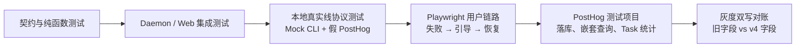

# Run Analytics v4 测试与端到端验收方案

## 1. 文档信息

| 项目 | 内容 |
| --- | --- |
| 测试对象 | `run_created`、`run_finished`、恢复动作曝光/点击、启动前拦截、Task 成功率查询 |
| 目标 Provider | `amr`、`claude_code`、`codex_cli` |
| Schema | `event_schema_version = 4`；旧扁平参数在兼容窗口继续双写 |
| 主要角色 | Open Design QA、研发、数据分析 |
| 核心目标 | 验证事件能发出、参数语义正确、跨 Run 能归并、PostHog 中能正确查询 |

最新 `main` 已经使用 v3 表达 MCP/Plugin 来源归因，因此本次代码落地使用 v4；本文中的 v4 对应需求文档里原规划的聚合与任务成功率方案。

## 2. 测试结论必须回答的问题

1. AMR、Claude Code、Codex 的首轮执行、失败和恢复 Run 是否都能正常上报。
2. 首次失败、后续重试成功时，多个 Run 是否共享同一个 `task_execution_id`。
3. Task 成功率是否按“一次用户意图”计算，而不是把第一次失败永久算作失败。
4. `failure_category`、`failure_reason`、`failure_stage` 是否只描述最终失败 Run，并且可稳定分组。
5. 新的聚合对象是否能在 PostHog 中按点号路径查询，数值是否保留为数值类型。
6. 旧扁平字段是否继续发送，旧版本事件和旧看板是否仍然可用。
7. HTML、媒体、辅助资源和多轮微调是否遵守新的 Artifact 口径。
8. 关闭数据上报后是否不发送产品分析事件，敏感内容是否不会进入事件。

## 3. 核心不变量

下列条件任一不满足，本次改造不能发布：

- 每个实际创建的 Run 有唯一 `run_id`，正常终态只有一条 `run_finished`。
- 首 Run 满足 `initial_run_id = run_id`、`task_run_index = 0`。
- 手动重试、Resume、授权后重试、切模型、切 Runtime 和澄清回答复用原 `task_execution_id`，新 Run 的 `task_run_index` 加一。
- 同一 Run 内的自动重试不改变 `run_id`，也不增加 `task_run_index`。
- 任一关联 Run 有效成功后，Task 状态不可逆地成为 `success`。
- `result = success` 但 `clarification_requested = true` 的 Run 不是有效成功 Run。
- `run_activity.artifacts.changed_file_count` 只解释文件变化规模，不能直接决定 Task 是否成功。
- `primary_artifact_change` 在 Ask、Plan、澄清 Run 和 Design System Run 中省略。
- 未采集到的值省略；不能为了字段完整而伪造为 `0`。
- v4 事件继续携带兼容期要求的旧字段；旧版本继续保持自身的 v2/v3 Schema，不改写历史数据。

## 4. 测试分层



| 层级 | 验证内容 | 是否依赖外部系统 |
| --- | --- | --- |
| L1 契约/单元 | 类型、聚合映射、Token 和 Artifact 口径、Task ID 继承 | 否 |
| L2 应用集成 | 消息持久化、恢复回调、Daemon 终态补偿、启动拦截 | 否 |
| L3 线协议 E2E | 实际 Daemon 发送的 PostHog batch、压缩、公共参数、隐私 | 否，使用本地接收器 |
| L4 UI E2E | 用户看到恢复动作、点击、创建目标 Run、最终成功 | 否，使用 Mock CLI |
| L5 PostHog 验收 | JSON 对象真实落库、点号查询、HogQL、事件延迟 | 是，使用独立测试项目 |
| L6 灰度对账 | 新旧字段覆盖率和线上真实 Provider 差异 | 是，使用 beta/prerelease 数据 |

## 5. 测试数据准备

### 5.1 基础条件

- 使用本分支构建的应用，确认 `event_schema_version = 4`。
- 使用隔离的开发命名空间，并按仓库的 Daemon data directory contract 提供隔离数据根。
- 正向用例开启 Metrics；反向用例明确关闭 Metrics。
- 每个测试创建独立 `project_id`、`conversation_id` 和安装身份，避免与其他验证数据混淆。
- Provider 行为优先使用 `mocks/` 中的匿名真实 Trace 回放，避免消耗额度并保证失败可复现。
- 发布前再对当前真实 AMR、Claude Code、Codex CLI 各做一次最小 Smoke，用于发现 CLI 版本或流格式漂移。

### 5.2 黄金任务集

AMR、Claude Code、Codex 每个 Provider 分别执行以下 4 个 Task：

| Task | Run 序列 | 最终 Task 状态 |
| --- | --- | --- |
| T1 | 首 Run 直接成功 | `success` |
| T2 | 首 Run 系统失败，不恢复 | `system_failed` |
| T3 | 首 Run 失败 → 手动重试成功 | `success` |
| T4 | 首 Run 请求澄清 → 用户回答 → 新 Run 成功 | `success` |

每个 Provider 的固定预期：

- Task 数：4。
- Task 成功数：3。
- Task 系统失败数：1。
- Task 成功率：75%。
- Run 数：6。
- 有效成功 Run：3。
- 系统失败 Run：2。
- 澄清 Run：1，不进入有效成功/失败分母。
- 有效 Run 成功率：`3 / (3 + 2) = 60%`。

这组数据是上线验收基线。如果结果仍显示 Task 成功率 60%，说明查询仍在错误地按 Run 统计。

## 6. 测试用例矩阵

### A. Task 与恢复链路

| ID | 优先级 | 测试场景 | 前置条件与步骤 | 预期结果 |
| --- | --- | --- | --- | --- |
| A01 | P0 | 三个 Provider 首 Run 成功 | 分别选择 AMR、Claude Code、Codex，发送可稳定完成的 Design 任务 | 各产生一对 `run_created`/`run_finished`；Task 字段完整；`result=success` |
| A02 | P0 | 首 Run 最终失败 | Mock CLI 返回可分类的终态错误，不点击恢复 | `run_finished.result=failed`；失败分类、原因和阶段存在；Task 为 `system_failed` |
| A03 | P0 | 手动重试挽回 | 首 Run 失败，点击 Retry，第二个 Run 成功 | 两个 Run ID 不同、Task ID 相同；第二个 `task_run_index=1`、`source_run_id` 指向首 Run；Task 只算一次成功 |
| A04 | P0 | Resume 挽回 | 制造可恢复的中断，点击 Continue | 目标 Run 使用 `recovery_action_type=resume_run`；曝光、点击、创建和完成共享 `recovery_action_instance_id` |
| A05 | P0 | 切 Runtime 挽回 | Claude/Codex 失败后切换到 AMR 并重试成功 | Task 归属仍是首 Run Provider；恢复分析可看到源 Provider 和目标 `amr` |
| A06 | P0 | 切模型挽回 | 制造模型不可用，选择其他模型重试 | 新 Run 使用实际目标模型；`recovery_action_type=switch_model_retry`；Task ID 不变 |
| A07 | P0 | 授权后重试 | AMR 返回登录/授权错误，完成授权后自动或手动重试 | 新 Run 使用 `authorize_and_retry`；重复的已登录轮询不能重复创建 Run |
| A08 | P0 | 澄清回答 | 首 Run 输出 `<question-form>`，用户提交回答，后续 Run 成功 | 首 Run `clarification_requested=true`，不算有效成功；回答 Run 与原 Task 相连并最终使 Task 成功 |
| A09 | P0 | 同 Run 自动重试 | 首次 Provider 调用遇到可自动重试错误，第二次调用成功 | `run_id` 和 Task 序号不变；只有一条最终 `run_finished`；`automatic_retry.retry_count>0` 且最终成功 |
| A10 | P0 | 启动前拦截后恢复 | BYOK 缺 Key/模型，点击发送被拦截；修复配置后重新发送同一 Draft | 先出现 `element=run_start_blocked`，当时没有 Run；恢复后首 Run 仍为 `task_run_index=0` 且继承原 Task ID |
| A11 | P1 | 连续两次恢复 | 首 Run 失败 → Retry 仍失败 → 切 Runtime 成功 | 三个 Run 的 `task_run_index` 为 0/1/2；每个 `source_run_id` 指向直接上一个 Run；Task 只归一为一次成功 |
| A12 | P1 | 成功后的普通继续修改 | 一个 Task 成功后，用户在 Composer 发起新的修改意图 | 新 Run 使用新的 `task_execution_id` 和 `task_run_index=0`，不能错误继承上一个成功 Task |
| A13 | P1 | 用户取消 | 用户主动停止唯一 Run | Task 归类为 `user_cancelled`，不进入系统失败率分母 |
| A14 | P1 | 仍在运行 | 查询时 Run 尚未终止 | Task 归类为 `in_progress`，不提前判为成功或失败 |

### B. Schema、聚合和兼容

| ID | 优先级 | 测试场景 | 前置条件与步骤 | 预期结果 |
| --- | --- | --- | --- | --- |
| B01 | P0 | `run_created` v4 必填字段 | 创建任意 Run 并检查原始事件 | 高频顶层字段、Task 字段、`has_attachments`、`tokens` 存在；Schema 为 4 |
| B02 | P0 | `run_finished` v4 必填字段 | 完成成功和失败 Run | `result`、`clarification_requested`、`timing.total_duration_ms` 存在；失败 Run 带失败事实 |
| B03 | P0 | 兼容期双写 | 检查同一 v4 事件的新旧字段 | `entry_from/entry_source`、`session_mode/interaction_mode`、旧 Token/新 `tokens` 等同时存在且事实值一致 |
| B04 | P0 | 缺失值不伪造成 0 | 使用没有 Provider Usage 的 Trace | 未观测计数省略；`usage_count_source=unknown`；不能出现虚假的 Provider Token 0 |
| B05 | P0 | 旧版本事件兼容 | 向测试项目发送一条 v3 Fixture，再发送 v4 事件 | 两者都可查询；只依赖旧字段的兼容查询仍能读取 v4 双写数据；历史 v3 不要求拥有 v4 对象 |
| B06 | P0 | 消息升级和重载 | 从旧数据库启动，执行一次 Run，重启后加载消息并 Retry | 增量迁移成功；`taskAnalytics` 持久化；重载后的 Retry 继续原 Task |
| B07 | P0 | Daemon 终态补偿 | Run 已终止但正常分析完成标记缺失，重启 Daemon | 补发一条带 v4 Task/聚合字段的 `run_finished`；再次重启不重复补发 |
| B08 | P1 | 数组字段 | 一个 Run 使用多个 Skill/MCP | `capabilities.skill_ids`、`mcp_server_ids` 保持数组；兼容期单值字段仍按旧规则发送 |
| B09 | P1 | Provider ID 标准化 | 分别由 AMR、Claude、Codex 触发恢复动作 | 所有 Run 和恢复事件统一使用 `amr`、`claude_code`、`codex_cli`，不能混入 `claude`/`codex` |

### C. Token 口径

| ID | 优先级 | 测试场景 | 前置条件与步骤 | 预期结果 |
| --- | --- | --- | --- | --- |
| C01 | P0 | Anthropic additive | 回放包含输入、cache read、cache write 的 Claude Trace | `input_accounting_mode=additive`；Provider 原始值和统一有效输入值均正确 |
| C02 | P0 | OpenAI inclusive | 回放 Codex/OpenAI 风格 Usage | `input_accounting_mode=inclusive`；缓存读取不被重复加到有效输入 |
| C03 | P0 | 未知 Usage | Provider 只给 total 或不给 Usage | 未知拆分省略；来源标记为 `unknown` 或真实的 `provider_usage`，不能捏造 input/output |
| C04 | P0 | 首次模型调用 | 一个 Run 内有多次模型调用 | `tokens.first_model_call` 来自第一次调用，不得误取最后一次或累计值 |
| C05 | P0 | 新旧 Token 对账 | 对同一批 v4 事件比较旧扁平字段和 `tokens` | 同口径事实值 100% 一致；可派生的比率不要求在新对象重复发送 |
| C06 | P1 | JSON 数值类型 | 在 PostHog SQL 中读取 Token 嵌套字段 | 返回 Numeric/Integer，而不是序列化后的 JSON 字符串 |

### D. Artifact 口径

| ID | 优先级 | 测试场景 | 前置条件与步骤 | 预期结果 |
| --- | --- | --- | --- | --- |
| D01 | P0 | 首次生成 HTML | 项目没有已生成 Artifact，Run 修改预置种子 HTML | `primary_artifact_change=created`，不能因路径已存在误记为 modified |
| D02 | P0 | 多轮修改 HTML | 已有生成结果，第二个 Run 修改 HTML 内容 | `primary_artifact_change=modified`；`modified_file_count` 增加 |
| D03 | P0 | 只改 CSS/JS/TSX | 已有 HTML 主 Artifact，仅改变渲染依赖 | 旧 `artifact_count` 不膨胀；主 Artifact 记为 modified |
| D04 | P0 | HTML 加辅助 PNG | 同一 Run 修改 HTML 并新增多张图片 | 只有一个主 Artifact 变化；图片进入 `supporting_asset_files_changed_count` |
| D05 | P0 | 媒体项目 | 分别生成/修改图片、视频、音频 | 对应媒体是主 Artifact；首次为 created，后续为 modified |
| D06 | P0 | 同内容重写/仅时间变化 | 重写相同内容或只改变 mtime | 旧计数允许保持兼容语义；v4 内容变化计数为 0，主 Artifact 为 none |
| D07 | P0 | Ask、Plan、澄清 | 三类 Run 均不要求设计产出 | 省略 `primary_artifact_change`，不能发送 none 冒充产出判断 |
| D08 | P0 | Design System Run | 新建和修改 `DESIGN.md` | 使用 `design_system.change_type`；不重复发送 `primary_artifact_change` |
| D09 | P1 | 失败前已写部分文件 | Agent 写入文件后最终失败 | 可记录文件变化，但 `result` 和 Task 仍为失败；不能因 Artifact 写入改成成功 |

### E. 恢复动作事件

| ID | 优先级 | 测试场景 | 前置条件与步骤 | 预期结果 |
| --- | --- | --- | --- | --- |
| E01 | P0 | CTA 曝光 | 打开带 Retry、Continue 或切 AMR 的失败卡 | 每个实际展示的 CTA 各有一条 `surface_view`，不能只报动作数组 |
| E02 | P0 | CTA 点击 | 点击恢复 CTA | 发送 `ui_click`；ID 和动作类型与对应曝光一致 |
| E03 | P0 | 点击到 Run | CTA 点击后目标 Run 创建 | `recovery_action_instance_id` 从点击透传到 `run_created` 和 `run_finished` |
| E04 | P0 | 切换目标 | 点击切模型或切 Runtime | Click 事件包含目标 Provider/模型；目标 Run 上报实际使用值 |
| E05 | P1 | 重复渲染去重 | 失败卡因状态更新多次重渲染 | 同一 CTA 实例不会重复发送曝光；真实再次展示的新实例可以发送 |
| E06 | P1 | 点击但未启动 | 用户点击后授权失败或关闭流程 | 有曝光/点击但没有目标 Run；不能虚构一次 Run 尝试或改变原 Task 结果 |

### F. 隐私、去重和稳定性

| ID | 优先级 | 测试场景 | 前置条件与步骤 | 预期结果 |
| --- | --- | --- | --- | --- |
| F01 | P0 | Metrics 关闭 | 关闭 Metrics 后完成 Run | 不发送 `run_created`、`run_finished` 和恢复 UI 产品分析事件 |
| F02 | P0 | 敏感内容扫描 | Prompt、响应、路径、Key 使用唯一哨兵字符串 | 捕获的事件序列中不包含任何哨兵字符串或绝对路径 |
| F03 | P0 | 终态去重 | 模拟正常结束、断线重连和 Daemon 重启 | 同一 Run 的有效 `run_finished` 只有一条，或由相同 insert ID 被 PostHog 去重 |
| F04 | P1 | PostHog 延迟 | 事件写入测试项目后轮询查询 | 在约定超时内可查到；测试使用轮询而不是固定 sleep |
| F05 | P1 | 大对象和数组 | Skill/MCP 数量达到产品允许上限 | 事件没有因 Payload 过大被丢弃；聚合对象结构完整 |

## 7. P0 详细执行场景

### 场景 1：首 Run 直接成功

**测试目标：** 验证三个目标 Provider 的基础 Run 事件和 v4 字段。

**起始条件：**

- 新项目、新对话，Metrics 已开启。
- Mock CLI 配置为一次成功并生成可识别 Artifact。
- 当前 Provider 依次为 AMR、Claude Code、Codex。

**执行步骤：**

1. 在 Design 模式发送唯一 Prompt。
2. 等待应用显示完成，并确认预览中存在结果。
3. 等待 PostHog 接收 `run_created` 和 `run_finished`。
4. 用 `run_id` 查询两条事件并比较公共、Task 和聚合字段。

**预期结果：**

- `agent_provider_id` 分别为 `amr`、`claude_code`、`codex_cli`。
- 首 Run 的 Task ID 在 created/finished 中一致，`initial_run_id=run_id`、`task_run_index=0`。
- `result=success`，`clarification_requested=false`。
- 新旧字段同时存在；`tokens`、`timing` 可作为 JSON 查询。

### 场景 2：首轮失败，手动重试成功

**测试目标：** 验证重试成功后 Task 不再被统计为失败。

**起始条件：** Mock CLI 第一条 Run 固定失败，第二条 Run 固定成功。

**执行步骤：**

1. 发送任务并等待失败卡出现。
2. 记录失败 Run ID。
3. 确认 Retry CTA 曝光，点击 Retry。
4. 等待第二条 Run 成功。
5. 按 `task_execution_id` 查询全部事件并执行 Task 状态查询。

**预期结果：**

- 首 Run `result=failed`，第二 Run `result=success`。
- 两个 Run 共用 Task ID；第二 Run 的 `source_run_id` 等于首 Run ID。
- 曝光、点击、第二 Run 共享一个恢复动作实例 ID。
- 该 Task 最终只计为一个 `success`，不同时保留一个失败 Task。

### 场景 3：切 Runtime 到 AMR 后成功

**测试目标：** 验证 Task 主归属和恢复效果归因互不混淆。

**起始条件：** Claude Code 或 Codex 首 Run 固定失败；AMR 固定成功。

**执行步骤：**

1. 使用源 Provider 发送任务并等待失败。
2. 点击切换到 AMR 并重试。
3. 等待 AMR Run 成功。
4. 查询 Task 和恢复动作链路。

**预期结果：**

- Task 主看板仍归属首 Run Provider。
- 恢复点击包含源 Provider 和目标 `amr`。
- 目标 Run 的 `agent_provider_id=amr`，Task ID 不变。
- 恢复分析将成功归因给 `switch_runtime_retry`。

### 场景 4：请求澄清后回答成功

**测试目标：** 验证澄清 Run 不会提前把任务记为成功或失败。

**起始条件：** Mock CLI 首 Run 输出合法 `<question-form>`，回答后生成 Artifact。

**执行步骤：**

1. 发送含歧义的任务。
2. 确认 Questions 面板出现，首 Run 正常结束。
3. 提交回答。
4. 等待回答 Run 成功。
5. 查询两条 Run 和最终 Task 状态。

**预期结果：**

- 首 Run `result=success` 且 `clarification_requested=true`，不是有效成功。
- 回答 Run 使用 `recovery_action_type=question_answer`、`task_run_index=1`。
- 最终 Task 为 success；成功归因来自回答 Run。

### 场景 5：启动前拦截后恢复

**测试目标：** 验证尚未创建 Run 的配置拦截仍能保留 Task 身份。

**起始条件：** BYOK 选择已启用，但缺少 API Key 或模型。

**执行步骤：**

1. 输入唯一 Draft 并点击发送。
2. 确认跳转设置且没有创建 Run。
3. 修复配置，返回并重新发送同一个 Draft。
4. 等待 Run 成功。

**预期结果：**

- 拦截时产生 `run_start_blocked`，没有 `run_created`。
- 恢复后的 Run 继承拦截事件 Task ID。
- 因此前没有 Run，恢复 Run 仍为 `task_run_index=0` 且 `initial_run_id=run_id`。

### 场景 6：自动重试成功

**测试目标：** 验证同 Run 自动重试不会膨胀 Run/Task 失败数。

**起始条件：** Mock Trace 首次返回可自动重试的临时错误，下一次成功。

**执行步骤：**

1. 发送任务并等待自动重试完成。
2. 查询所有 `run_retry_attempted`、`run_retry_finished` 和最终 `run_finished`。
3. 按 Run ID 和 Task ID 计数。

**预期结果：**

- 只有一个 Run ID、一条最终 `run_finished`。
- `automatic_retry.retry_count > 0` 且 `outcome=success`。
- Task 只包含一个 `task_run_index=0` 的 Run。

### 场景 7：Artifact 首次生成与后续微调

**测试目标：** 验证作品变化与底层文件变化分离。

**起始条件：** Prototype 项目带种子 HTML，后续可修改 CSS 和新增 PNG。

**执行步骤：**

1. 首 Run 修改种子 HTML，生成第一个可用预览。
2. 第二 Run 仅修改 CSS。
3. 第三 Run 修改 HTML 并新增两张 PNG。
4. 第四 Run 重写相同内容。

**预期结果：**

- 四次 `primary_artifact_change` 依次为 created、modified、modified、none。
- CSS 修改不增加旧 `artifact_count`，但能修改主 Artifact。
- 两张 PNG 进入辅助资源计数，不把一个作品解释成三个主 Artifact。
- 相同内容重写不进入 v4 内容变化计数。

### 场景 8：Daemon 重启补偿

**测试目标：** 验证异常退出不丢终态，也不会重复上报。

**起始条件：** 运行日志中存在已终止但分析未完成的 Run 状态。

**执行步骤：**

1. 在终态事件完成标记落盘前终止 Daemon。
2. 重启 Daemon，等待终态扫描。
3. 查询补发事件。
4. 再重启一次并再次查询。

**预期结果：**

- 首次重启补发一条 `terminal_reconciled=true` 的 v4 `run_finished`。
- 任务字段、失败分类、Timing 和 Token 来源仍可用。
- 第二次重启不再新增同一终态事件。

## 8. 推荐的端到端验证方法

### 8.1 第一阶段：本地线协议 E2E，作为 PR 必过项

新增一个 Daemon 集成测试，结构可复用现有媒体分析测试的本地 PostHog 接收器：

1. 启动本地 HTTP 接收器，接收 PostHog batch，并支持解压 gzip。
2. 将 `POSTHOG_HOST` 指向接收器，提供测试 Key，开启 Metrics。
3. 启动真实 Daemon，但把 AMR、Claude、Codex CLI 替换为仓库 Mock Trace。
4. 通过真实 `/api/runs` 创建 Run，而不是直接调用聚合 Builder。
5. 收集 `run_created`、`run_finished`，断言完整 Payload、公共参数和隐私。
6. 对一次失败和一次恢复成功提交相同 `task_execution_id`，验证线协议上的任务归并。

建议新增文件：`apps/daemon/tests/run-analytics-v4-e2e.test.ts`。

这一层能证明“应用真的把正确 JSON 发出了”，但不能证明 PostHog 已按 JSON 类型存储、点号查询可用。

### 8.2 第二阶段：Playwright 用户链路，作为 PR 必过项

新增一条 UI E2E，使用真实 Web + Daemon + Mock CLI：

1. 打开全新项目并发送任务。
2. Mock CLI 让首 Run 失败，页面出现恢复卡。
3. 点击 Retry、Continue 或切 AMR。
4. 第二个 Mock Run 成功。
5. 从 `/api/runs` 请求体读取 `analyticsHints.taskExecutionId` 和恢复动作实例 ID。
6. 断言两个请求的任务链路，并检查最终 UI Artifact 可用。

建议新增文件：`e2e/ui/run-analytics-recovery.spec.ts`。

这一层证明“用户动作确实驱动了正确的目标 Run”，避免组件单测通过但真实页面没有透传。

### 8.3 第三阶段：PostHog 独立测试项目，作为发布必过项

本地接收器不能替代真实 PostHog。发布前使用独立测试项目完成以下验证：

1. 给测试构建配置测试项目的 Ingest Key，并使用唯一环境标记。
2. 执行黄金任务集，每个 Provider 4 个 Task。
3. 通过 PostHog SQL Editor 或 Query API 轮询事件，不能用固定等待时间。
4. 验证以下嵌套路径可直接查询和 Breakdown：
   - `properties.tokens.effective_input_tokens`
   - `properties.timing.total_duration_ms`
   - `properties.diagnostics.runtime_timing.model_first_token_ms`
   - `properties.run_activity.artifacts.changed_file_count`
5. 验证黄金数据的 Task 成功率为 75%，有效 Run 成功率为 60%。
6. 导出少量查询结果，确认对象没有被整体序列化成字符串。

PostHog 当前支持用点号访问嵌套/JSON 属性，也支持在筛选、趋势和 Breakdown 中使用 SQL 表达式，具体见 [SQL expressions](https://posthog.com/docs/sql/expressions)。通过 [Query API](https://posthog.com/docs/api/queries) 查询时，需要项目 ID 和具有 Query Read 权限的个人 API Key。

### 8.4 第四阶段：灰度双写对账，作为停止旧字段的前置条件

beta/prerelease 上线后至少观察一个完整版本周期且不少于 14 天：

- 按 `agent_provider_id × app_version × runtime_type` 检查 v4 覆盖率。
- 新旧同口径事实字段逐事件对账，目标为 100% 一致。
- Artifact 的新旧差异必须能由“同内容重写/mtime”和“渲染依赖”规则解释。
- 检查旧看板是否把 Schema 精确限制为 3；如有，先改为兼容 3/4 或使用版本化查询。
- 只有看板、告警、导出和查询全部切换后，才能停止旧扁平字段。

## 9. PostHog 验收查询

### 9.1 查询单个 Task 的完整链路

```sql
SELECT
    timestamp,
    event,
    properties.run_id,
    properties.task_execution_id,
    properties.initial_run_id,
    properties.source_run_id,
    properties.task_run_index,
    properties.recovery_action_type,
    properties.recovery_action_instance_id,
    properties.agent_provider_id,
    properties.model_id,
    properties.result,
    properties.clarification_requested
FROM events
WHERE properties.task_execution_id = '<task-id>'
ORDER BY timestamp
```

验收：Run 顺序、恢复来源、动作 ID 和最终结果与 UI 操作完全一致。

### 9.2 验证嵌套字段真实可查

```sql
SELECT
    properties.run_id,
    properties.tokens.effective_input_tokens,
    properties.tokens.first_model_call.cache_read_tokens,
    properties.timing.total_duration_ms,
    properties.diagnostics.runtime_timing.model_first_token_ms,
    properties.run_activity.artifacts.changed_file_count
FROM events
WHERE event = 'run_finished'
  AND properties.event_schema_version = 4
  AND properties.project_id = '<e2e-project-id>'
ORDER BY timestamp
```

验收：字段可直接读取；数值可以参与求和、平均值和 Breakdown，而不是一整段字符串。

### 9.3 Task 成功率

```sql
WITH task_outcomes AS (
    SELECT
        properties.task_execution_id AS task_id,
        max(if(
            properties.result = 'success'
            AND properties.clarification_requested = false,
            1,
            0
        )) AS has_success,
        max(if(properties.result = 'failed', 1, 0)) AS has_system_failure
    FROM events
    WHERE event = 'run_finished'
      AND properties.event_schema_version = 4
      AND properties.project_id = '<golden-project-id>'
    GROUP BY task_id
)
SELECT
    count() AS eligible_tasks,
    sum(has_success) AS successful_tasks,
    avg(has_success) AS task_success_rate
FROM task_outcomes
WHERE has_success = 1 OR has_system_failure = 1
```

黄金任务集验收：每个 Provider 单独查询均为 `eligible_tasks=4`、`successful_tasks=3`、`task_success_rate=0.75`。

### 9.4 新旧 Token 双写一致性

```sql
SELECT
    count() AS finished_events,
    sum(if(
        properties.input_tokens_effective
            = properties.tokens.effective_input_tokens,
        1,
        0
    )) AS matching_events
FROM events
WHERE event = 'run_finished'
  AND properties.event_schema_version = 4
  AND properties.input_tokens_effective IS NOT NULL
  AND properties.project_id = '<e2e-project-id>'
```

验收：同口径事实字段 `matching_events = finished_events`。

## 10. 当前自动化覆盖与缺口

### 已覆盖

- `packages/contracts/tests/analytics-run-finished-contract.test.ts`：v4 类型、聚合对象和兼容字段。
- `apps/web/tests/analytics/run-task-analytics.test.ts`：Task 初始化、重载回退和跨 Run 继承。
- `apps/web/tests/components/ChatPane.resume-failed.test.tsx`：Resume CTA 曝光、点击和回调。
- `apps/web/tests/components/ProjectView.run-isolation.test.tsx`：启动前拦截。
- `apps/web/tests/components/ProjectView.run-cleanup.test.tsx`：真实 ProjectView 发送、终态和重载主链路。
- `e2e/ui/amr-run-failure-recovery.test.ts`：真实 UI 失败卡、Retry、目标 Run 和成功内容恢复链路。
- `apps/daemon/tests/run-analytics-observability.test.ts`：Provider Usage、缓存和首次调用 Token。
- `apps/daemon/tests/run-artifact-fs.test.ts`：HTML/媒体、内容变化、CSS 依赖和种子 HTML。
- `apps/daemon/tests/db-message-events.test.ts`：Task analytics 消息持久化。
- `apps/daemon/tests/runtimes/run-terminal-reconciliation.test.ts`：Daemon 重启补偿。

### 尚未覆盖，建议补齐后再合并

1. 尚无一条测试通过真实 `/api/runs` 把本次 v4 `run_created`/`run_finished` 发到本地 PostHog 接收器。
2. 尚未在真实 PostHog 测试项目验证嵌套字段的点号查询、Breakdown 和导出。
3. 尚未执行 beta/prerelease 的新旧字段生产样本对账。

## 11. 发布门槛

| 阶段 | 必须满足 |
| --- | --- |
| PR 合并前 | 当前单元/集成测试和现有 UI 恢复链路通过；新增本地线协议 E2E；类型检查和 guard 通过 |
| Beta 前 | PostHog 测试项目完成黄金任务集；三个 Provider 均有当前 CLI 真实 Smoke |
| Prerelease 前 | Task 成功率和 Run 成功率查询经产品、数据、研发三方核对；错误分布可按三层分类拆分 |
| 停止旧字段前 | 双写至少一个完整版本周期且不少于 14 天；新旧同口径字段 100% 对账；所有看板与导出已迁移 |

## 12. 最终建议

端到端验收应以“黄金任务集查询结果”为最终判定，而不是以“Network 面板里看到了事件”为判定。推荐形成下面的固定闭环：

1. Mock Trace 产生确定性的成功、失败、澄清和恢复序列。
2. 真实 UI 驱动这些序列，验证用户动作和 Task ID 继承。
3. Daemon 通过真实 SDK 发送事件，验证线协议与隐私。
4. PostHog 测试项目执行相同 Task 查询，验证最终 75% Task 成功率。
5. Beta 数据继续做新旧字段双写对账，确认无 Provider/版本覆盖盲区。

只有五层都通过，才能说明本次埋点改造不仅“代码正确”，而且“统计结果可信”。
